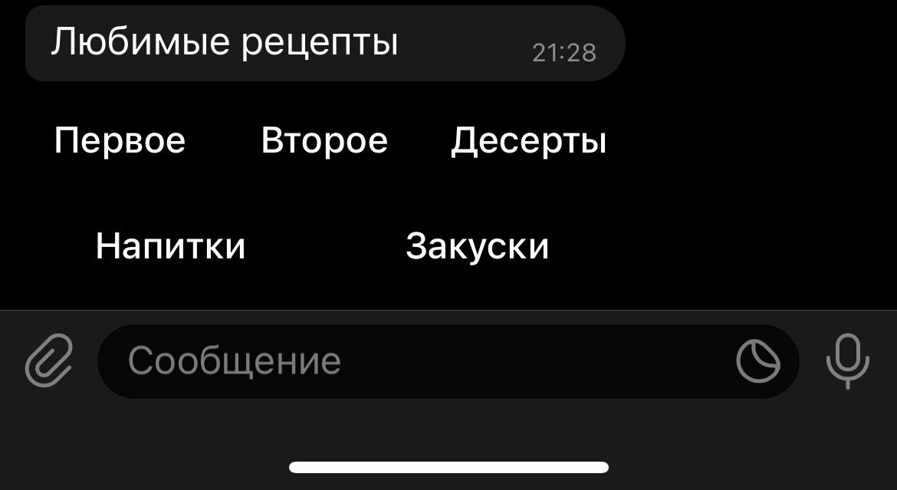

# The_HouseholderBot
telegram bot - home secretary (pyTelegramBotAPI)

 Бот - личный домашний помощник.

 Первоначальный функционал заключается в рассылке напоминаний о поливе моих комнатных цветов.

 В процессе разработки были добавлены:

<ul> 
  <li>краткая информация о домашних растениях;</li>

  <li>возможность общаться с ботом;</li>
  <li>информация о текущей дате, о погоде;</li>

  <li>фильтр ругательных слов;</li>
  <li>меню рецептов с контентом.</li>

  </ul>
  
 Для запуска бота необходимо получить свой token и зарегистрировать имя бота через @BotFather в Telegram(https://t.me/BotFather).

  
 Далее в модуле bot.py прописать полученный токен:  <b>bot = telebot.TeleBot(ваш token)</b>

  
 Запуск бота осуществляется через модуль handlers.py

